# Week 7 – Delta Lake Incremental Data Processing Assignment

## Overview

This assignment demonstrates how to implement incremental data processing using Delta Lake in Azure Databricks. The project focuses on loading customer data from CSV files, performing data cleaning, creating a Delta table, processing incremental updates, and applying a MERGE operation to implement Slowly Changing Dimension (SCD Type 1) behavior.

The solution uses PySpark and Delta Lake to efficiently handle updates and inserts while maintaining data quality through validation checks.

---

## Objective

The primary objectives of this assignment are:

- Load customer master data into a Spark DataFrame.
- Perform data quality checks for missing values and duplicate records.
- Clean and standardize customer data.
- Store the cleaned dataset as a Delta table.
- Load incremental customer data.
- Process updates and new customer records.
- Perform Delta Lake MERGE operations.
- Validate the final dataset after processing.
- Demonstrate SCD Type 1 implementation using Delta Lake.

---

## Technologies Used

| Technology | Purpose |
|------------|----------|
| Azure Databricks | Data Processing Platform |
| PySpark | Data Transformation |
| Delta Lake | Transactional Data Storage |
| Unity Catalog Volume | File Storage |
| Python | Programming Language |
| CSV Files | Input Data Source |

---

## Project Structure

```text
Week7/
└── delta-lake-assignment/
    ├── README.md
    ├── data/
    │   ├── customer_master.csv
    │   └── customer_incremental.csv
    ├── notebooks/
    │   └── delta_scd_assignment.ipynb
    ├── screenshots/
    │   ├── data_loading/
    │   ├── data_cleaning/
    │   ├── scd1/
    │   ├── scd2/
    │   ├── validation/
    │   └── final_output/
    └── report/
```

---

## Dataset Description

### Master Dataset

The master dataset contains the initial customer records.

Columns:

- customer_id
- customer_name
- email
- city
- phone
- updated_at

Intentional Data Quality Issues:

- Missing city value for Customer ID 108
- Duplicate record for Customer ID 110

---

### Incremental Dataset

The incremental dataset contains updates and new customer records.

Updates:

| Customer ID | Change |
|------------|---------|
| 102 | Email and City Updated |
| 104 | Email and City Updated |
| 107 | City Updated |

New Customers:

| Customer ID |
|------------|
| 111 |
| 112 |
| 113 |

Intentional Data Quality Issues:

- Missing city value for Customer ID 112
- Duplicate record for Customer ID 113

---

## Implementation Steps

### Step 1: Load Master Dataset

The customer master CSV file is loaded into a Spark DataFrame using PySpark.

```python
master_df = spark.read.csv(
    MASTER_FILE,
    header=True,
    inferSchema=True
)
```

Output:

- Total Records: 11

---

### Step 2: Data Exploration

The schema of the dataset is examined to understand data types and structure.

Checks Performed:

- Schema validation
- Missing value detection
- Duplicate customer identification

---

### Step 3: Data Cleaning

The following transformations are applied:

#### Missing Value Handling

Missing city values are replaced with:

```text
Unknown
```

#### Duplicate Removal

Duplicate customer records are removed using:

```python
dropDuplicates(["customer_id"])
```

#### Standardization

- Customer names are trimmed.
- Emails are converted to lowercase.
- Extra spaces are removed.

Results:

| Metric | Value |
|----------|---------|
| Raw Rows | 11 |
| Clean Rows | 10 |

---

### Step 4: Create Delta Table

The cleaned master dataset is stored in Delta format.

```python
master_clean.write \
    .format("delta") \
    .mode("overwrite") \
    .save(DELTA_PATH)
```

Benefits of Delta Lake:

- ACID Transactions
- Schema Enforcement
- Time Travel
- Efficient MERGE Operations

---

### Step 5: Load Incremental Dataset

The incremental customer file is loaded into a Spark DataFrame.

Output:

- Raw Incremental Records: 7

---

### Step 6: Clean Incremental Data

The same cleaning logic is applied:

- Handle missing city values.
- Remove duplicate customer IDs.
- Standardize email and customer name fields.

Results:

| Metric | Value |
|----------|---------|
| Raw Records | 7 |
| Clean Records | 6 |

---

### Step 7: Delta Lake MERGE Operation

The MERGE operation is used to perform an upsert between the Delta table and the incremental dataset.

```python
customer_delta.alias("t") \
    .merge(
        inc_clean.alias("s"),
        "t.customer_id = s.customer_id"
    ) \
    .whenMatchedUpdateAll() \
    .whenNotMatchedInsertAll() \
    .execute()
```

---

## SCD Type 1 Implementation

This assignment implements Slowly Changing Dimension Type 1.

### Update Behavior

If a customer ID already exists:

```text
Old Record → Replaced by New Record
```

Example:

Before:

| Customer ID | City |
|------------|------|
| 102 | Ahmedabad |

After:

| Customer ID | City |
|------------|------|
| 102 | Pune |

---

### Insert Behavior

If a customer ID does not exist:

```text
New Record → Inserted
```

Examples:

- 111
- 112
- 113

---

## Validation

### Final Row Count Validation

Formula:

```text
10 Existing Customers
+ 3 New Customers
--------------------
13 Final Customers
```

Output:

```text
Final Row Count = 13
```

---

### Duplicate Validation

Check:

```python
groupBy("customer_id")
```

Result:

```text
Duplicate Customer IDs = 0
```

---

### Updated Customer Validation

Verified Updates:

| Customer ID | Updated City |
|------------|--------------|
| 102 | Pune |
| 104 | Bengaluru |
| 107 | Mumbai |

---

### New Customer Validation

Verified Insertions:

| Customer ID | City |
|------------|------|
| 111 | Pune |
| 112 | Unknown |
| 113 | Surat |

---

## Screenshots

### Data Loading

| Screenshot | Preview |
|------------|----------|
| Master Dataset Loaded | 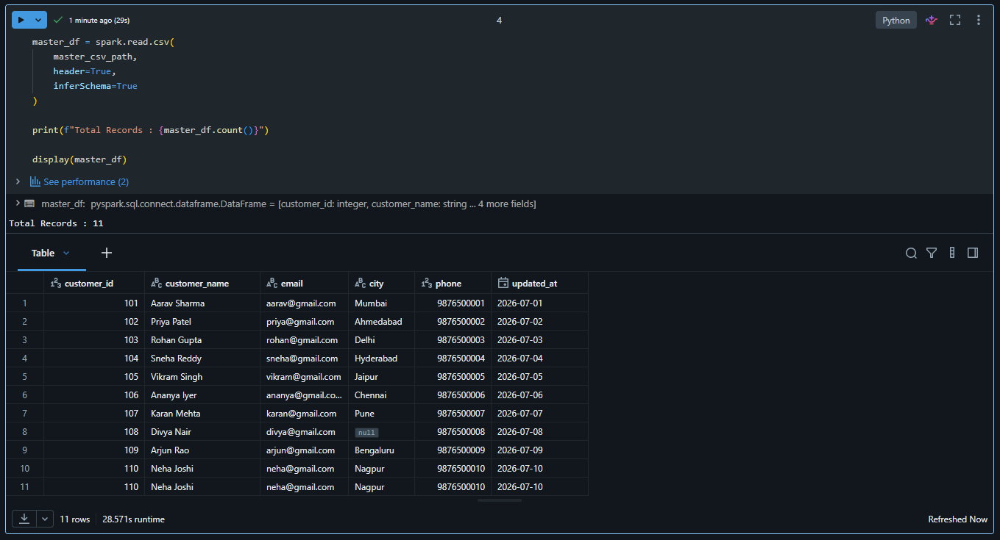 |
| Delta Table Loaded | 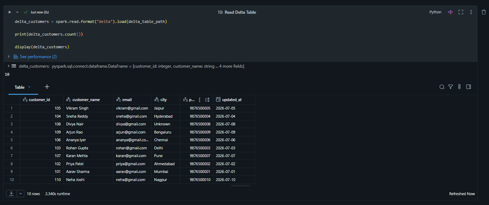 |
| Incremental Dataset Loaded | 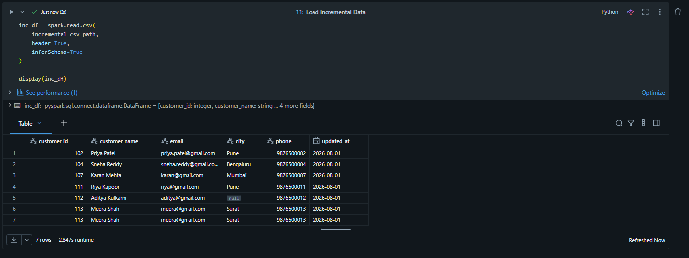 |

---

### Data Cleaning

| Screenshot | Preview |
|------------|----------|
| Missing Value Check | 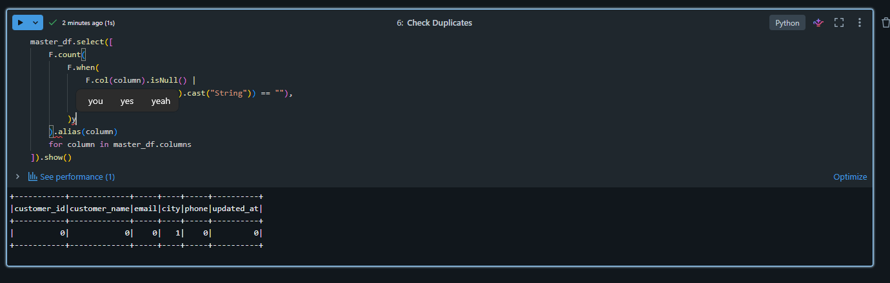 |
| Duplicate Records Check | 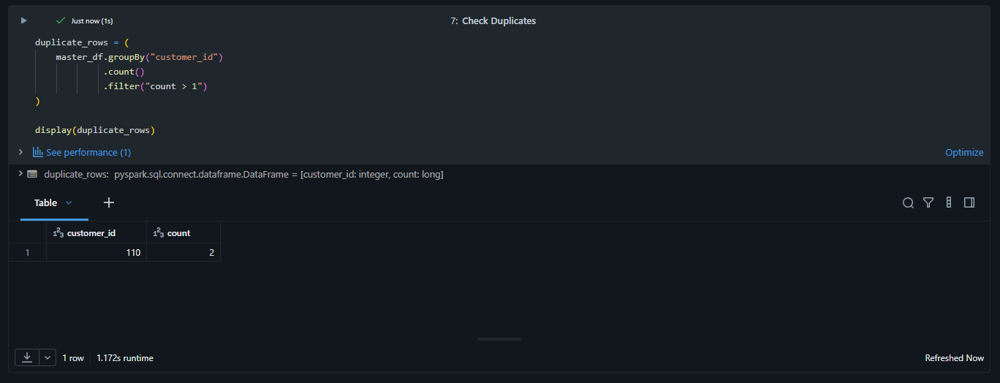 |
| Master Data Cleaned | 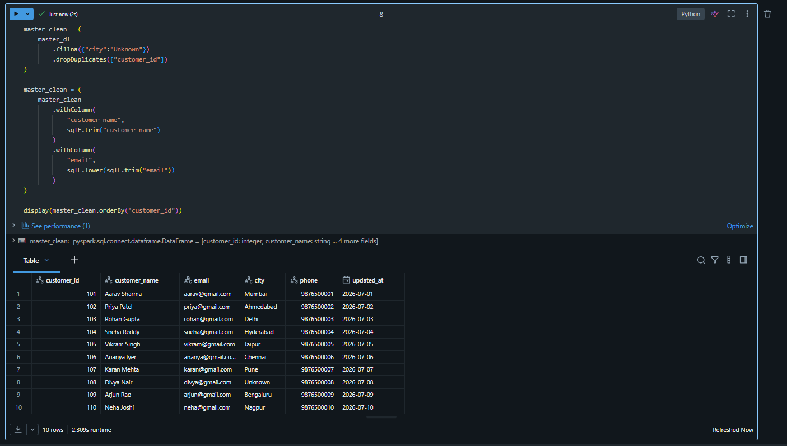 |
| Delta Table Created | 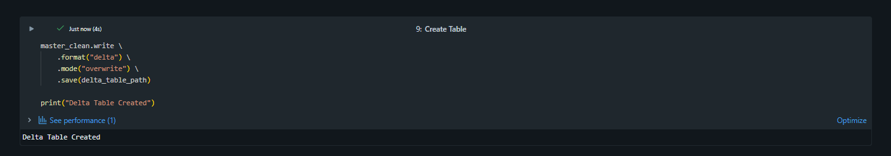 |
| Incremental Data Cleaned | 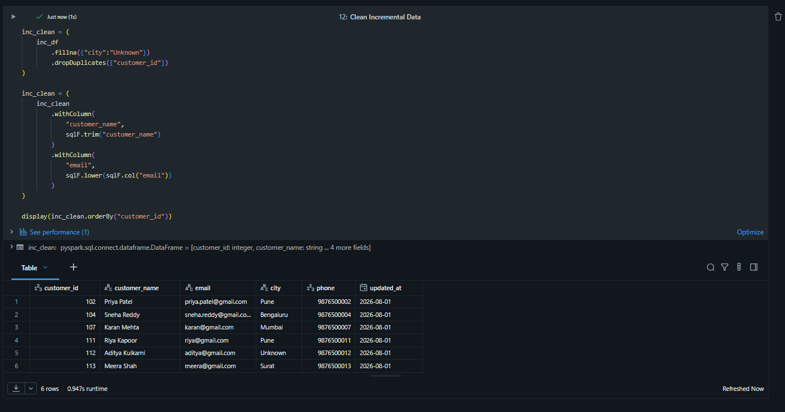 |

---

### SCD Type 1 Processing

#### Source Data Before MERGE

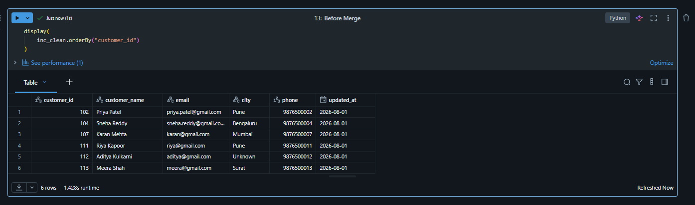

#### MERGE Operation Completed

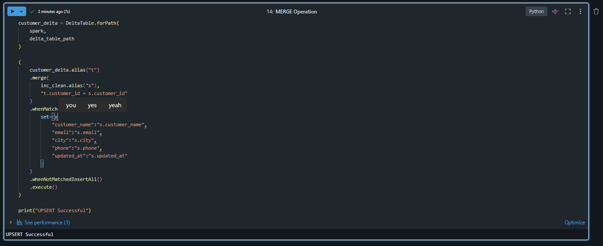

---

### Validation

#### Final Row Count Validation


#### Duplicate Validation

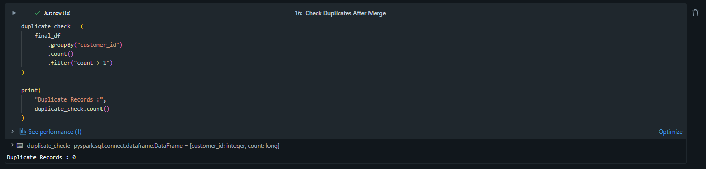

#### Updated Customer Validation

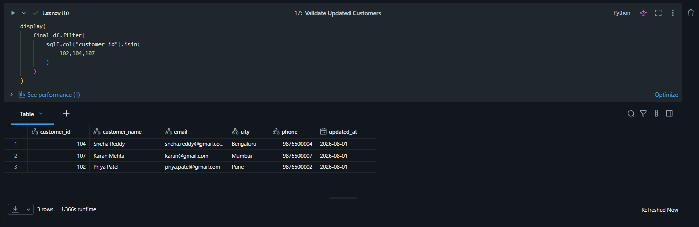

#### Inserted Customer Validation

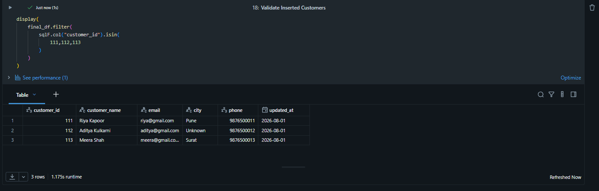

---

### Final Output

#### Final Customer Dataset

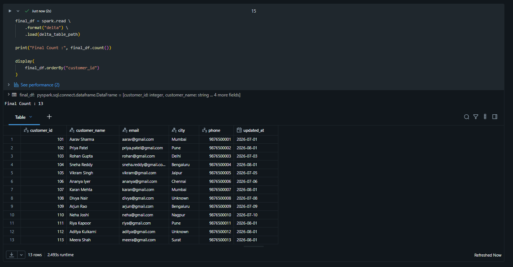

#### Assignment Summary

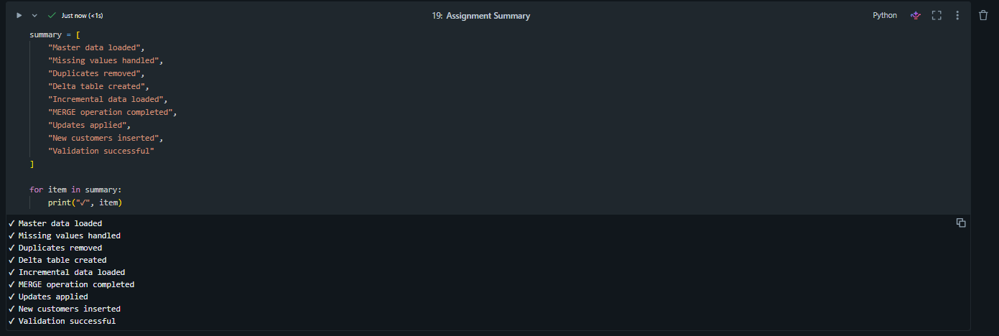

### Data Loading

- master_data_loaded.png
- read_delta_table.png
- load_incremental_csv.png

### Data Cleaning

- master_data_cleaned.png
- delta_table_created.png
- incremental_data_cleaned.png

### SCD Processing

- merge_before.png
- merge_completed.png

### Validation

- final_row_count.png
- no_duplicates.png

### Final Output

- final_dataset.png
- assignment_summary.png

---

## Key Learnings

Through this assignment, the following concepts were learned:

- Working with Azure Databricks Serverless Compute.
- Reading and processing CSV files using PySpark.
- Data quality checks and cleansing techniques.
- Creating and managing Delta Lake tables.
- Implementing MERGE operations.
- Understanding Slowly Changing Dimension (SCD Type 1).
- Handling incremental data processing.
- Validating data integrity after transformations.

---

## Conclusion

This assignment successfully demonstrates incremental data processing using Delta Lake in Azure Databricks. Customer master data was cleaned and stored as a Delta table, incremental customer records were processed, and a Delta Lake MERGE operation was used to update existing customers and insert new customers. Data validation confirmed that the final dataset contained 13 unique customer records with no duplicate customer IDs.

The project showcases how Delta Lake simplifies modern data engineering workflows by providing reliable, scalable, and efficient support for incremental data processing and SCD Type 1 implementations.