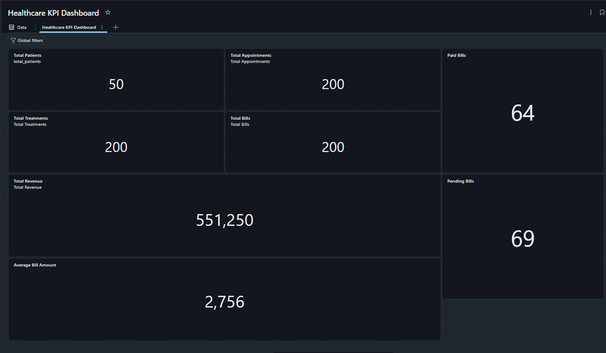

# 🏥 Healthcare & Hospital Management System

## Medallion Architecture | Azure Databricks | Delta Lake

A complete healthcare data engineering project implementing a **Medallion Architecture** using **Azure Databricks, PySpark, SQL, Delta Lake, and Databricks Workflows**.

The project processes healthcare data through **Landing → Bronze → Silver → Gold** layers and produces business-ready KPIs through a **Databricks SQL Dashboard**.

---

## 📌 Project Overview

The Healthcare & Hospital Management System is designed to build a scalable data engineering pipeline for processing healthcare and hospital data.

The solution follows the **Medallion Architecture**:

```text
                 Source CSV Files
                       │
                       ▼
                ADLS Landing Zone
                       │
                       ▼
                ┌──────────────┐
                │    BRONZE    │
                │ Raw Delta    │
                │    Tables    │
                └──────────────┘
                       │
                       ▼
                ┌──────────────┐
                │    SILVER    │
                │ Cleaned &    │
                │ Transformed  │
                │    Tables    │
                └──────────────┘
                       │
                       ▼
                ┌──────────────┐
                │     GOLD     │
                │ KPI &        │
                │ Summary      │
                │    Tables    │
                └──────────────┘
                       │
                       ▼
              Databricks SQL
                  Dashboard
```

---

# 🎯 Project Objectives

* Build a healthcare data engineering pipeline using Medallion Architecture.
* Ingest raw healthcare CSV data into Azure Data Lake Storage.
* Create Bronze Delta tables for raw data.
* Clean and transform data in the Silver layer.
* Create business-ready Gold KPI tables.
* Implement data quality validation.
* Maintain audit information for pipeline processing.
* Build a Databricks SQL KPI dashboard.
* Automate the pipeline using Databricks Workflows.
* Schedule the pipeline for daily execution.

---

# 🛠️ Technology Stack

| Technology                   | Purpose                          |
| ---------------------------- | -------------------------------- |
| Azure Data Lake Storage Gen2 | Data storage                     |
| Azure Databricks             | Data engineering platform        |
| PySpark                      | Data processing                  |
| Apache Spark                 | Distributed processing           |
| Delta Lake                   | Reliable table storage           |
| Databricks SQL               | SQL analytics                    |
| Databricks SQL Dashboard     | KPI visualization                |
| Databricks Workflows         | Pipeline orchestration           |
| SQL                          | Data analysis and transformation |
| Python                       | Data engineering logic           |

---

# 🏗️ Architecture

```text
                    ┌─────────────────────┐
                    │    Source CSVs      │
                    │                     │
                    │ Patients            │
                    │ Doctors             │
                    │ Appointments        │
                    │ Billing             │
                    │ Treatments          │
                    └──────────┬──────────┘
                               │
                               ▼
                    ┌─────────────────────┐
                    │    ADLS Landing     │
                    │        Zone         │
                    └──────────┬──────────┘
                               │
                               ▼
                    ┌─────────────────────┐
                    │       BRONZE        │
                    │                     │
                    │ bronze_patients     │
                    │ bronze_doctors      │
                    │ bronze_appointments │
                    │ bronze_billing      │
                    │ bronze_treatments   │
                    └──────────┬──────────┘
                               │
                               ▼
                    ┌─────────────────────┐
                    │       SILVER        │
                    │                     │
                    │ silver_patients     │
                    │ silver_doctors      │
                    │ silver_appointments │
                    │ silver_billing      │
                    │ silver_treatments   │
                    └──────────┬──────────┘
                               │
                               ▼
                    ┌─────────────────────┐
                    │        GOLD         │
                    │                     │
                    │ Patient Summary     │
                    │ Billing Summary     │
                    │ Treatment Summary   │
                    │ Doctor Performance  │
                    │ Appointment Summary │
                    │ Patient 360         │
                    └──────────┬──────────┘
                               │
                    ┌──────────┴──────────┐
                    ▼                     ▼
          ┌──────────────────┐   ┌──────────────────┐
          │ Databricks SQL   │   │ Audit Reporting  │
          │    Dashboard     │   │                  │
          └──────────────────┘   └──────────────────┘
```

---

# 📂 Data Sources

The project uses five healthcare source datasets:

1. Patients
2. Doctors
3. Appointments
4. Billing
5. Treatments

The source files are initially stored in the **ADLS Landing Zone** before being processed through the Bronze layer.

---

# 🥉 Bronze Layer

The Bronze layer stores the ingested source data as Delta tables.

### Bronze Tables

```text
bronze_patients
bronze_doctors
bronze_appointments
bronze_billing
bronze_treatments
```

The Bronze layer preserves the source data and provides the foundation for downstream transformations.

---

# 🥈 Silver Layer

The Silver layer performs data cleaning, transformation, validation, and standardization.

### Silver Tables

```text
silver_patients
silver_doctors
silver_appointments
silver_billing
silver_treatments
```

Typical processing includes:

* Data type standardization
* Null handling
* Duplicate handling
* Data validation
* Date standardization
* Data quality checks
* Business transformations

---

# 🥇 Gold Layer

The Gold layer contains business-ready datasets designed for analytics and reporting.

### Gold Tables

```text
gold_appointment_summary
gold_doctor_performance
gold_patient_360_summary
gold_patient_billing_summary
gold_patient_summary
gold_patient_treatment_summary
```

These tables provide aggregated information for healthcare business analysis.

---

# 📊 KPI Dashboard


A **Databricks SQL Dashboard** was created using the Gold tables.

The dashboard contains KPI visualizations including:

* Total Patients
* Total Appointments
* Total Treatments
* Total Bills
* Total Revenue
* Average Bill Amount
* Paid Bills
* Pending Bills

### Dashboard Preview

The dashboard provides a centralized view of the major healthcare business metrics.

Example KPI results from the completed dashboard:

| KPI                 |   Value |
| ------------------- | ------: |
| Total Patients      |      50 |
| Total Appointments  |     200 |
| Total Treatments    |     200 |
| Total Bills         |     200 |
| Total Revenue       | 551,250 |
| Average Bill Amount |   2,756 |
| Paid Bills          |      64 |
| Pending Bills       |      69 |

> KPI values represent the dataset processed during project execution.

---

# ⚙️ Databricks Workflow

The complete pipeline is orchestrated using **Databricks Workflows**.

The workflow is structured as follows:

```text
Notebook_00_Setup_Config
             │
             ▼
Notebook_01_Bronze_Ingestion
             │
       ┌─────┼─────┬─────┐
       ▼     ▼     ▼     ▼
      02    03    04    05
    Silver Silver Silver Silver
       └─────┼─────┴─────┘
             ▼
      Notebook_06_Gold_KPI
        Gold + Audit
```

### Workflow Notebooks

| Notebook                  | Purpose                                  |
| ------------------------- | ---------------------------------------- |
| `00_setup_config`         | Setup configuration and metadata         |
| `01_ingest_bronze`        | Bronze ingestion                         |
| `02_silver_appointments`  | Silver appointment processing            |
| `03_silver_billing`       | Silver billing processing                |
| `04_silver_doctors`       | Silver doctor processing                 |
| `05_silver_treatments`    | Silver treatment processing              |
| `06_gold_patient_summary` | Gold KPI computation and audit reporting |

The Silver notebooks are configured to execute after Bronze ingestion and can run in parallel.

The Gold notebook runs after the Silver processing is complete.

---

# 🔄 Pipeline Execution

The complete pipeline follows these stages:

```text
1. Create ADLS containers
          ↓
2. Upload source CSV files
          ↓
3. Setup configuration and metadata
          ↓
4. Ingest raw data into Bronze
          ↓
5. Clean and transform data into Silver
          ↓
6. Validate Silver data
          ↓
7. Generate Gold KPI tables
          ↓
8. Generate audit information
          ↓
9. Display KPIs through Databricks SQL Dashboard
          ↓
10. Schedule workflow for daily execution
```

---

# 🔍 Data Quality

Data quality checks are performed during the Silver processing stage.

The pipeline considers areas such as:

* Null values
* Duplicate records
* Invalid data types
* Invalid dates
* Missing values
* Record counts
* Data consistency

The objective is to ensure that only cleaned and validated data reaches the Gold layer.

---

# 📝 Audit Logging

The project includes audit information for monitoring pipeline execution.

The audit process helps track:

* Pipeline execution
* Processing status
* Source information
* Record processing
* Pipeline activity

Audit logic is incorporated into the Gold processing workflow.

---

# 📅 Automation

The Databricks Workflow is configured for **daily execution**.

```text
Daily Trigger
      ↓
Setup
      ↓
Bronze
      ↓
Silver
      ↓
Gold
      ↓
Audit
      ↓
Dashboard Data
```

This allows the healthcare analytics pipeline to be refreshed automatically.

---

# 📁 Project Structure

```text
Healthcare-Medallion-Architecture/
│
├── notebooks/
│   │
│   ├── 00_setup_config
│   ├── 01_ingest_bronze
│   ├── 02_silver_appointments
│   ├── 03_silver_billing
│   ├── 04_silver_doctors
│   ├── 05_silver_treatments
│   └── 06_gold_patient_summary
│
├── screenshots/
│   ├── adls-landing.png
│   ├── bronze-tables.png
│   ├── silver-tables.png
│   ├── gold-tables.png
│   ├── kpi-dashboard.png
│   └── databricks-workflow.png
│
├── README.md
│
└── .gitignore
```

---

# 🚀 Implementation Roadmap

| Phase            | Step | Activity                           | Status |
| ---------------- | ---: | ---------------------------------- | ------ |
| Phase 1 — Setup  |    1 | Create ADLS containers             | ✅      |
| Phase 1 — Setup  |    2 | Upload 5 source CSV files          | ✅      |
| Phase 1 — Setup  |    3 | Run Notebook 00 — Setup Config     | ✅      |
| Phase 2 — Bronze |    4 | Configure metadata                 | ✅      |
| Phase 2 — Bronze |    5 | Run Notebook 01 — Bronze Ingestion | ✅      |
| Phase 3 — Silver |    6 | Run Notebooks 02–05                | ✅      |
| Phase 3 — Silver |    7 | Validate Silver tables             | ✅      |
| Phase 4 — Gold   |    8 | Compute Gold KPIs                  | ✅      |
| Phase 4 — Gold   |    9 | Connect Gold tables to dashboard   | ✅      |
| Phase 5 — Ops    |   10 | Schedule daily Databricks Workflow | ✅      |
| Phase 5 — Ops    |   11 | Audit reporting                    | ✅      |

---

# 📈 Business Insights

The Gold layer enables healthcare management to analyze:

### Patient Management

* Total number of patients
* Patient-level activity
* Patient appointment history
* Patient billing information

### Appointment Management

* Total appointments
* Completed appointments
* Cancelled appointments
* No-show appointments

### Billing Analysis

* Total bills
* Paid bills
* Pending bills
* Revenue
* Average billing amount

### Treatment Analysis

* Treatment volume
* Treatment-level billing
* Treatment performance

### Doctor Performance

* Doctor-level activity
* Appointment performance
* Patient interactions

---

# 🔐 Security & Privacy

This project is designed as a demonstration healthcare data engineering system.

For production deployment:

* Credentials should be stored using secure secret management.
* Access should follow least-privilege principles.
* Sensitive healthcare data should be protected.
* Personally identifiable information should not be exposed publicly.
* Production environments should implement appropriate healthcare compliance controls.

**No credentials, access tokens, passwords, or secrets should be committed to this repository.**

---

# 🧪 Testing & Validation

The pipeline was validated by checking:

* Bronze table creation
* Silver table creation
* Gold table creation
* Record counts
* KPI query results
* Dashboard outputs
* Workflow dependencies
* Daily workflow scheduling

---

# 💡 Key Learning Outcomes

Through this project, the following technologies and concepts were implemented:

* Azure Data Lake Storage
* Azure Databricks
* PySpark
* Spark SQL
* Delta Lake
* Medallion Architecture
* ETL/ELT pipelines
* Data quality
* Data transformation
* SQL analytics
* KPI development
* Databricks SQL Dashboards
* Databricks Workflows
* Pipeline orchestration
* Audit logging
* Git and GitHub

---

# 👨💻 Author

**Yadnyesh Sawant**

MCA — MIT World Peace University

### Technologies

`Python` `PySpark` `SQL` `Azure` `Databricks` `Delta Lake` `Git` `GitHub`

---

# ⭐ Project Summary

This project demonstrates an end-to-end healthcare data engineering solution using Azure Databricks and the Medallion Architecture.

Raw healthcare data is ingested into the Bronze layer, cleaned and transformed in the Silver layer, aggregated into business-ready Gold tables, and finally presented through a Databricks SQL KPI dashboard.

The pipeline is orchestrated using Databricks Workflows and configured for automated daily execution.

```text
SOURCE
  ↓
ADLS LANDING
  ↓
BRONZE
  ↓
SILVER
  ↓
GOLD
  ↓
KPI DASHBOARD
  ↓
AUTOMATED WORKFLOW
```

**End-to-end Healthcare Data Engineering Pipeline — Completed ✅**