# Celebal Excellence Internship Data Engineer

## Week 4 Assignment: Azure Cloud Fundamentals and Data Pipeline Implementation using ADF

---

### Problem Statement
Understand Azure cloud concepts and build a complete, end-to-end data pipeline using an Azure Storage Account and Azure Data Factory (ADF).

### Objective
Understand Azure cloud concepts and build an end-to-end data pipeline using Storage Account and Azure Data Factory — covering resource provisioning, storage setup, ADF pipeline development, execution, and access management.

### Step-by-Step Implementation
The assignment was executed in a structured manner, covering resource provisioning, storage setup, ADF pipeline development, execution, and IAM configuration.

1. **Task 1 – Explore Azure Portal & Create a Resource Group**
   * Explored the Azure Portal and created a dedicated Resource Group to hold all project resources.

     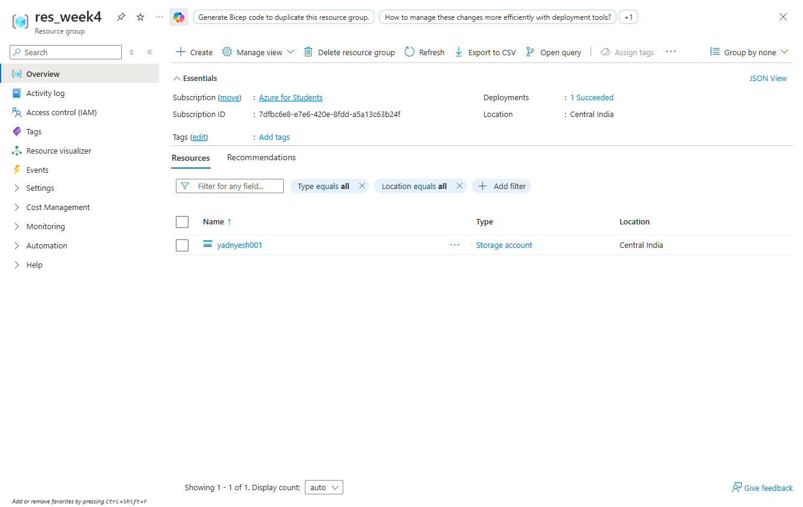

2. **Task 2 – Storage Setup**
   * Created a Storage Account (`yadnyesh001`).

     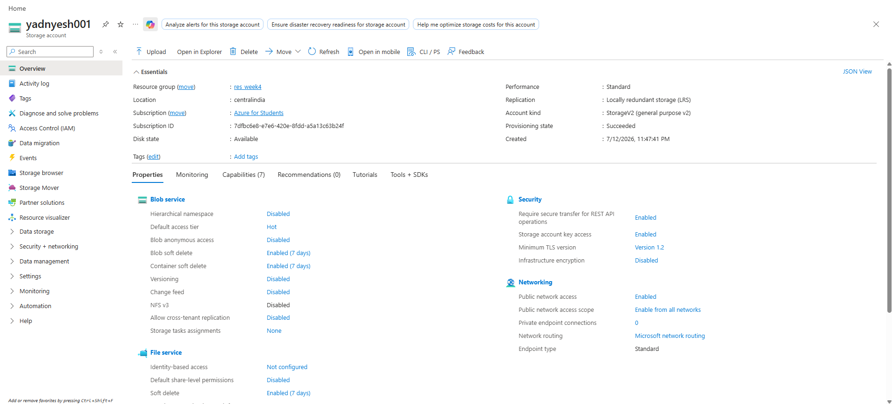

   * Created Blob Containers (`source-data` for input files, in addition to a default logs container).

     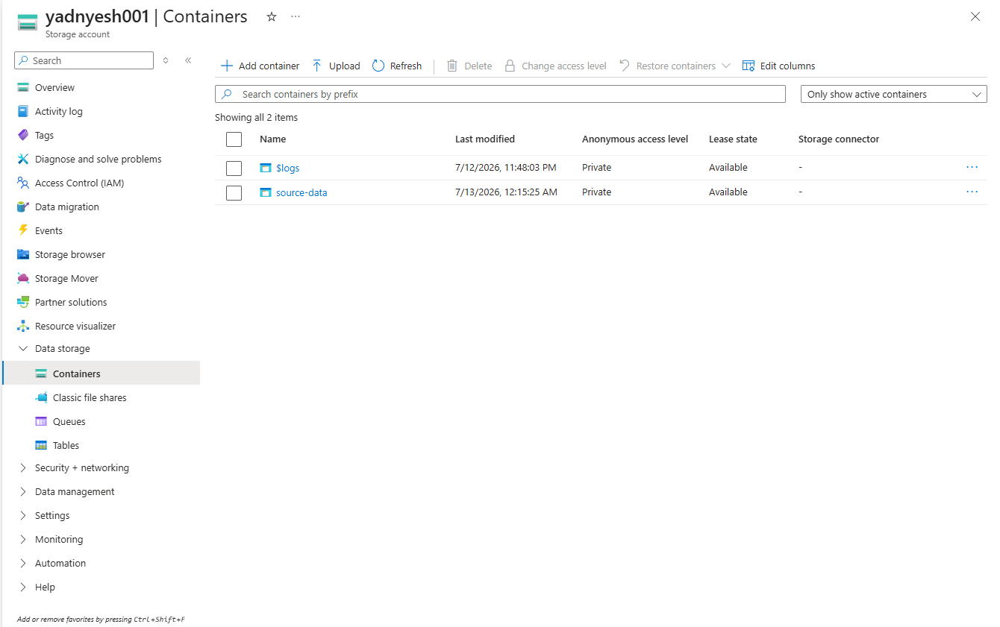

   * Uploaded a CSV file (Superstore dataset) into the `source-data` container.

     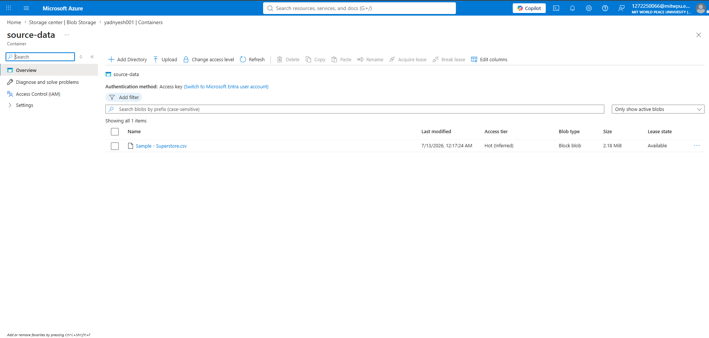

3. **Task 3 – ADF Basics**
   * Created an Azure Data Factory instance (`adfYadnyesh001`).

     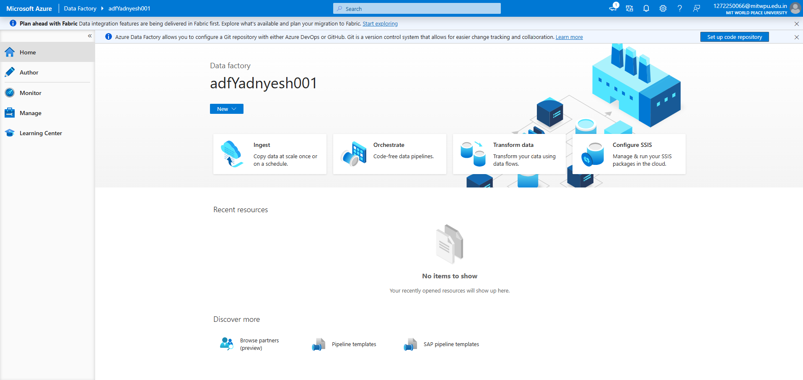

   * Explored the ADF UI — Home, Author, Monitor, and Manage tabs.

     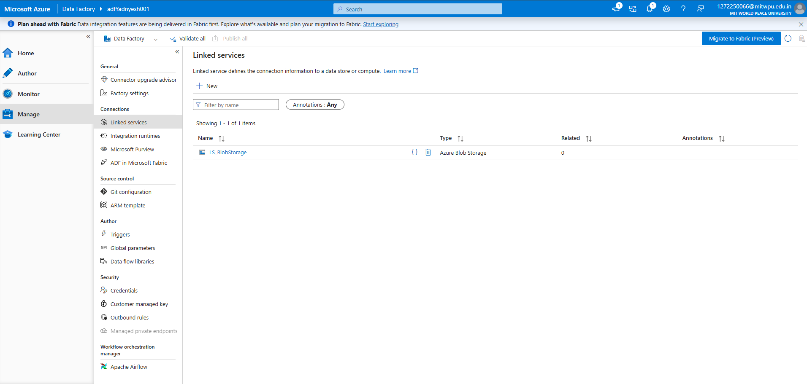

   * Created a Linked Service (`LS_BlobStorage`) to connect ADF to Blob Storage, and created the source dataset (`DS_Sourcecsv`) pointing to the uploaded CSV.

     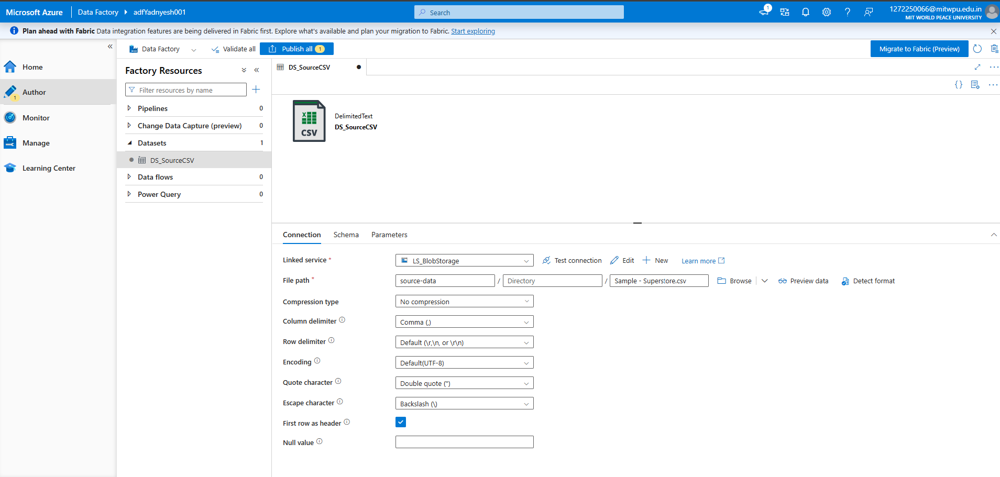

   * Built a pipeline (`PL_GetMetadata`) using the **Get Metadata** activity to retrieve file information from the source dataset.

     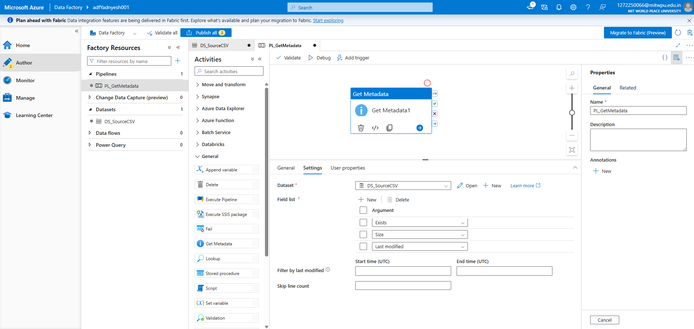

4. **Task 4 – Pipeline Development**
   * Created a pipeline (`PL_copycsv`) using the **Copy Data** activity, referencing the source dataset (`DS_Sourcecsv`) and a new destination dataset (`DS_Destinationcsv`).

     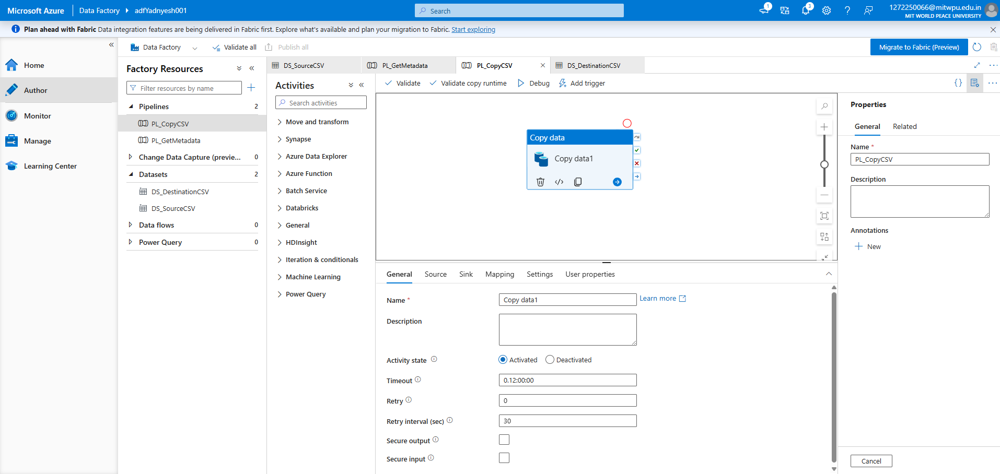

   * Configured the Copy activity's **Source** settings.

     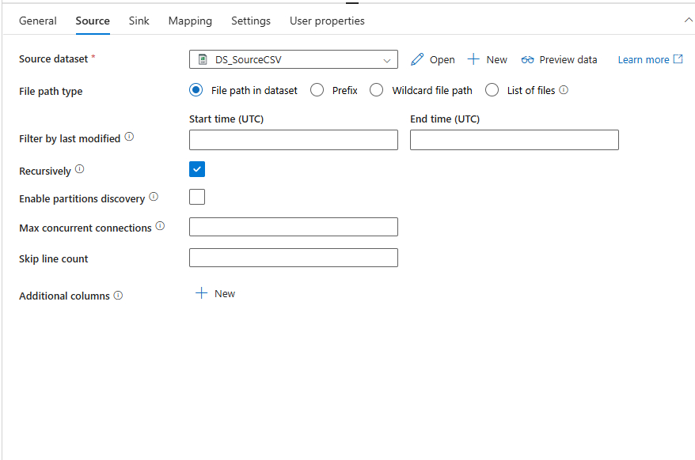

   * Configured the Copy activity's **Sink** (destination) settings.

     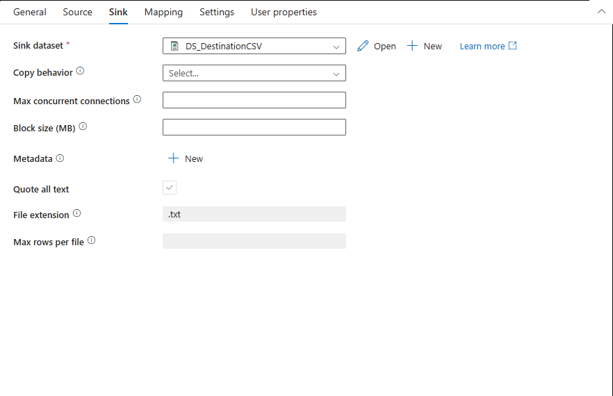

5. **Task 5 – Pipeline Execution**
   * Ran the pipelines in Debug mode and monitored the runs. The `PL_GetMetadata` pipeline completed with a **Succeeded** status.

     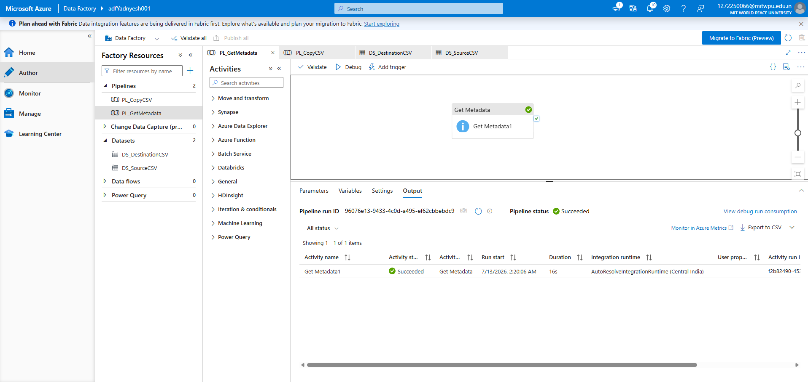

   * Debug run of the `PL_copycsv` (Copy Data) pipeline, monitored via the ADF Monitor tab.

     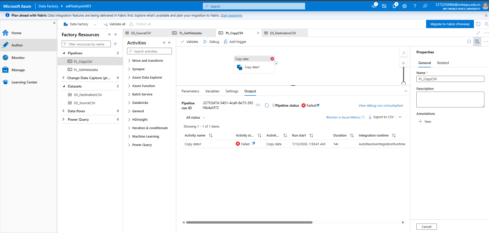

6. **Task 6 – IAM Roles**
   * Assigned Reader and Contributor roles and configured access between the Data Factory and the Storage Account via Access Control (IAM), so ADF could read from and write to the storage account.

7. **Mini Project: End-to-End Pipeline (Blob → ADF → Destination)**
   * Combined the Get Metadata and Copy Data activities into a single pipeline flow that reads the Superstore CSV from Blob Storage, validates its metadata, and copies it to a new destination location in the storage account.

### Outputs
* [`screenshots/`](/week4/screenshots): All screenshots documenting Resource Group creation, Storage setup, ADF configuration, pipeline design, and pipeline execution.
* [`Week_4_Assignment.pdf`](/week4/Week_4_Assignment.pdf): The final report document with all screenshots and a summary of the pipeline implementation.

### Summary
This assignment covered the fundamentals of Azure cloud infrastructure — from provisioning a Resource Group and Storage Account to building and orchestrating a data pipeline in Azure Data Factory. The pipeline reads a CSV file from Blob Storage, retrieves its metadata using a Get Metadata activity, and copies it to a destination location using a Copy Data activity, with IAM roles configured to enable secure access between ADF and Storage.