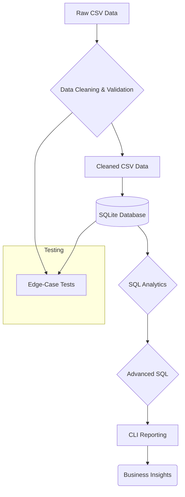

# Week 8 – E-Commerce Order Analytics System Assignment

## Overview

A comprehensive e-commerce data engineering and analytics system built with Python and SQLite. The project simulates an end-to-end data pipeline: it generates synthetic e-commerce data containing controlled data quality anomalies, applies automated data cleaning rules, stores the clean relational dataset in SQLite, performs intermediate and advanced SQL analytics (including window functions, cohort retention modeling, and product associations), and exposes reports through an interactive command-line interface.

This assignment illustrates how raw, unstructured transactional CSV logs can be ingested, validated, structured into an indexed database schema, and queried to output critical metrics like customer retention cohorts and product affinity patterns.

---

## Objective

The primary objectives of this assignment are:

- **Anomalous Data Generation**: Create a synthetic dataset representing customers, products, orders, and transaction line items with realistic quality issues.
- **Automated Data Cleansing**: Implement robust Python logic to clean email formats, enforce referential integrity, handle nulls/blanks, format timestamps, and filter duplicate records.
- **Relational Database Modeling**: Design a standard SQLite database schema with primary key, foreign key, and check constraints.
- **Advanced SQL Analytics**: Implement querying logic for category performance analysis, customer lifetime value (CLV) quartiles, year-over-year revenue growth, cohort retention analysis, and self-join-based product association.
- **CLI Reporting Dashboard**: Construct an interactive terminal command-line tool to query sales performance and return rates on arbitrary time frames (daily, weekly, monthly).
- **Edge-Case Validation**: Write a Python unit testing suite to verify database constraint violations and edge-case handling.

---

## Technologies Used

| Technology | Purpose |
| :--- | :--- |
| **Python** | Data generation, validation, SQLite loading, interactive CLI, and test execution |
| **SQLite** | Local relational database storage enforcing schema rules and constraints |
| **SQL** | Structured queries for complex business intelligence (CTEs, Window Functions, Cohorts) |
| **CSV** | Intermediary file storage for raw and clean data schemas |

---

## Project Structure

```text
week8/
├── data/
│   ├── raw/                  # Generated CSV files with intentional quality issues
│   │   ├── customers.csv
│   │   ├── products.csv
│   │   ├── orders.csv
│   │   └── order_items.csv
│   └── cleaned/              # Cleaned CSV files ready for database ingestion
│       ├── customers_clean.csv
│       ├── products_clean.csv
│       ├── orders_clean.csv
│       └── order_items_clean.csv
├── database/
│   └── ecommerce.db          # Relational SQLite database
├── output/
│   ├── data_quality_report.txt  # Audit log detailing cleaning steps and issues resolved
│   └── sample_reports/       # Exported sample output reporting logs
│       └── monthly_report.txt
├── scripts/
│   ├── generate_data.py      # Script to create raw synthetic datasets
│   ├── clean_data.py         # Python-based cleaning engine
│   ├── database.py           # Database setup and data ingestion script
│   ├── run_sql.py            # Basic SQL analysis query scripts
│   ├── run_window_queries.py # Window function query execution script
│   ├── run_advanced_queries.py # Advanced CTE, cohort, and association queries
│   └── report_cli.py         # Interactive CLI dashboard tool
├── sql/
│   ├── schema.sql            # Table structures, indices, and constraints
│   ├── aggregations.sql      # Standard GROUP BY queries
│   ├── window_functions.sql  # Window function analysis queries
│   └── cohort_analysis.sql   # Complex CTE, retention, and association queries
├── tests/
│   └── test_edge_cases.py    # Suite of unit tests for edge conditions
└── README.md                 # Project documentation
```

---

## Dataset Description

The system operates on four key entities generated programmatically:

### Customers Dataset
Initial registry of customer profiles.
- **Fields**: `customer_id`, `customer_name`, `email`, `registration_date`, `customer_type` (REGULAR, PREMIUM, VIP).
- **Anomalies introduced**: Invalid email formats (missing `@` or domains), blank fields, duplicated IDs.

### Products Dataset
Inventory catalog of items.
- **Fields**: `product_id`, `product_name`, `category`, `subcategory`, `cost_price`.
- **Anomalies introduced**: Out-of-bounds/zero cost prices, duplicate values.

### Orders Dataset
Customer purchase transactions.
- **Fields**: `order_id`, `customer_id`, `order_date`, `status` (PENDING, DELIVERED, CANCELLED, RETURNED), `region_code`.
- **Anomalies introduced**: Missing customer associations (orphan rows), corrupt dates, mismatched statuses.

### Order Items Dataset
Individual line items inside each order.
- **Fields**: `item_id`, `order_id`, `product_id`, `quantity`, `unit_price`, `discount_percent`.
- **Anomalies introduced**: Negative quantities (representing item returns), invalid order/product linkages, duplicate item entries.

---

## How It Works: The Analytics Pipeline

The system processes data through a complete, multi-stage pipeline:



---

## Implementation Steps

### Step 1: Generate Synthetic Data
Run the synthetic data generator to construct CSV tables under `data/raw/` containing intentional flaws.
* **Script**: [generate_data.py](/week8/scripts/generate_data.py)
* **Output**: 600 customers, 600 products, 1500 orders, and 3000 order items.

### Step 2: Data Cleaning
Clean raw datasets, filter duplicate rows, audit invalid structural values, and compile the report to `output/data_quality_report.txt`.
* **Script**: [clean_data.py](/week8/scripts/clean_data.py)
* **Audit Rule Actions**:
  - Drops rows with null critical fields.
  - Drops duplicate unique identifiers.
  - Validates e-mail regex matches.
  - Removes orphan orders lacking customer keys.
  - Formats date strings to uniform ISO-8601 timestamps.

### Step 3: Relational Schema & Loading
Set up the SQLite database file and read the cleaned CSV files into structured tables.
* **Script**: [database.py](/week8/scripts/database.py) (executes [schema.sql](/week8/sql/schema.sql))
* **Ingestion**: Registers database schemas enforcing constraints (`FOREIGN KEY` referential validation, `PRIMARY KEY` uniqueness, and discount check ranges `0-100`).

### Step 4: Basic SQL Analytics
Execute intermediate aggregated business reports.
* **Script**: [run_sql.py](/week8/scripts/run_sql.py) (executes [aggregations.sql](/week8/sql/aggregations.sql))
* **Key Queries**:
  - Revenue per product category.
  - Top 10 customer spending limits.
  - Last 12 months order counts.
  - Un-delivered transaction identification.
  - Return rate ratio per category.

### Step 5: Window Function Analytics
Implement analytical views focusing on moving/partitioned datasets.
* **Script**: [run_window_queries.py](/week8/scripts/run_window_queries.py) (executes [window_functions.sql](/week8/sql/window_functions.sql))
* **Key Queries**:
  - Running total revenue aggregated per region over time.
  - Category-based product ranking (using `DENSE_RANK()`).
  - Consecutive order lag differences per customer (using `LAG()`).
  - Identification of churn-risk customers (gaps > 30 days).

### Step 6: Advanced CTEs & Cohort Modeling
Run complex CTE operations to model cohort-based retention and market baskets.
* **Script**: [run_advanced_queries.py](/week8/scripts/run_advanced_queries.py) (executes [cohort_analysis.sql](/week8/sql/cohort_analysis.sql))
* **Key Queries**:
  - Monthly category customer classification.
  - Quartile-based customer lifetime value (using `NTILE(4)`).
  - Year-over-year revenue comparisons and growth percentages.
  - First-to-last category brand switches (using `FIRST_VALUE` and `LAST_VALUE`).
  - Cumulative customer contribution ratios.
  - Customer registration-cohort monthly retention rates.
  - Product market-basket associations (self-join pairs).

### Step 7: Interactive CLI Reporting
Launch the business intelligence tool that computes daily/weekly/monthly statistics in any arbitrary date range.
* **Script**: [report_cli.py](/week8/scripts/report_cli.py)

### Step 8: Edge-Case Testing
Confirm data integrity and database constraints are active and functional.
* **Script**: [test_edge_cases.py](/week8/tests/test_edge_cases.py)

---

## Project Demonstration & Query Output Log

The following execution output verifies that all components run correctly:

<details>
<summary>Click to view the full pipeline execution log</summary>

```bash
PS C:\Users\yadny\Downloads\celebal assignments\week8\scripts> python .\generate_data.py
============================================================
E-Commerce Order Analytics System
Generating raw datasets...
============================================================
Created: C:\Users\yadny\Downloads\celebal assignments\week8\data\raw\customers.csv
Created: C:\Users\yadny\Downloads\celebal assignments\week8\data\raw\products.csv
Created: C:\Users\yadny\Downloads\celebal assignments\week8\data\raw\orders.csv
Created: C:\Users\yadny\Downloads\celebal assignments\week8\data\raw\order_items.csv

============================================================
DATA GENERATION COMPLETE
============================================================
Customers   : 600
Products    : 600
Orders      : 1500
Order Items : 3000

PS C:\Users\yadny\Downloads\celebal assignments\week8\scripts> python .\clean_data.py
======================================================================
E-COMMERCE ORDER ANALYTICS SYSTEM
DATA CLEANING
======================================================================
Raw data loaded:
Customers   : 600
Products    : 600
Orders      : 1500
Order Items : 3000
Created: C:\Users\yadny\Downloads\celebal assignments\week8\data\cleaned\customers_clean.csv
Created: C:\Users\yadny\Downloads\celebal assignments\week8\data\cleaned\products_clean.csv
Created: C:\Users\yadny\Downloads\celebal assignments\week8\data\cleaned\orders_clean.csv
Created: C:\Users\yadny\Downloads\celebal assignments\week8\data\cleaned\order_items_clean.csv
Created: C:\Users\yadny\Downloads\celebal assignments\week8\output\data_quality_report.txt

======================================================================
DATA CLEANING COMPLETE
======================================================================
Invalid emails           : 12
Invalid order references : 0
Total issues reported    : 408

PS C:\Users\yadny\Downloads\celebal assignments\week8\scripts> python .\database.py
============================================================
E-COMMERCE ORDER ANALYTICS SYSTEM
DATABASE SETUP
============================================================
Database schema created successfully.
Existing table data cleared.
Loaded 600 rows into customers.
Loaded 600 rows into products.
Loaded 1500 rows into orders.
Loaded 3000 rows into order_items.

==================================================
DATABASE VERIFICATION
==================================================
customers      : 600
products       : 600
orders         : 1500
order_items    : 3000

Database connection closed.

PS C:\Users\yadny\Downloads\celebal assignments\week8\scripts> python .\run_sql.py

==========================================================================================
QUERY 1 - TOTAL REVENUE PER CATEGORY
==========================================================================================
category | total_revenue
------------------------------------------------------------------------------------------
Electronics | 75007950.89
Home | 69176897.48
Clothing | 59408743.73
Books | 29910792.36

==========================================================================================
QUERY 2 - TOP 10 CUSTOMERS
==========================================================================================
customer_id | customer_name | total_order_value
------------------------------------------------------------------------------------------
CUST0488 | Amit Joshi | 1860728.44
CUST0375 | Sneha Mehta | 1781172.01
CUST0306 | Yash Jadhav | 1698699.09
CUST0433 | Sneha Patel | 1680559.76
CUST0068 | Sneha Singh | 1609471.16
CUST0158 | Neha Mehta | 1539402.68
CUST0353 | Aditya Khan | 1507015.69
CUST0127 | Karan Kulkarni | 1496527.01
CUST0469 | Akash Singh | 1479150.73
CUST0311 | Akash Verma | 1466942.77

==========================================================================================
QUERY 3 - MONTH-WISE ORDER COUNT (Last 12 Months)
==========================================================================================
order_month | order_count
------------------------------------------------------------------------------------------
2025-08 | 63
2025-09 | 84
2025-10 | 76
2025-11 | 83
2025-12 | 93
2026-01 | 99
2026-02 | 69
2026-03 | 89
2026-04 | 67
2026-05 | 91
2026-06 | 90
2026-07 | 71

==========================================================================================
QUERY 4 - CUSTOMERS WITHOUT DELIVERED ITEMS (Sample of Top 10)
==========================================================================================
customer_id | customer_name
------------------------------------------------------------------------------------------
CUST0003 | Aditi Pawar
CUST0005 | Kavya Pawar
CUST0006 | Amit Singh
CUST0007 | Isha Kulkarni
CUST0008 | Neha Patel
CUST0010 | Vivaan Gupta
CUST0011 | Ananya Patel
CUST0012 | Karan Gupta
CUST0013 | Yash Singh
CUST0014 | Yash Khan
... (truncated for readability - 227 customers total) ...

==========================================================================================
QUERY 5 - PRODUCTS WITH MORE RETURNS THAN PURCHASES
==========================================================================================
product_id | product_name | total_purchased | total_returned
------------------------------------------------------------------------------------------
PROD0036 | Smartphone 12 | 5 | 10
PROD0242 | Jacket 2 | 1 | 5
PROD0428 | Lamp 20 | 3 | 5
PROD0455 | Cushion 23 | 1 | 5
PROD0494 | Curtains 14 | 3 | 5
PROD0060 | Tablet 12 | 1 | 4
PROD0399 | Table 15 | 1 | 2

==========================================================================================
QUERY 6 - RETURN RATE PER CATEGORY
==========================================================================================
category | returned_items | total_items | return_rate_percent
------------------------------------------------------------------------------------------
Home | 146 | 2552 | 5.72
Clothing | 125 | 2429 | 5.15
Books | 54 | 1163 | 4.64
Electronics | 115 | 2792 | 4.12

PS C:\Users\yadny\Downloads\celebal assignments\week8\scripts> python .\run_window_queries.py

====================================================================================================
QUERY 7 - RUNNING TOTAL BY REGION (Sample)
====================================================================================================
region_code | order_date | daily_revenue | running_total
----------------------------------------------------------------------------------------------------
CENTRAL | 2025-01-01 | 562435.38 | 562435.38
CENTRAL | 2025-01-04 | 398623.56 | 961058.94
CENTRAL | 2025-01-05 | 89679.09 | 1050738.03
CENTRAL | 2025-01-07 | 29144.71 | 1079882.74
...
EAST | 2025-01-01 | 291440.71 | 291440.71
EAST | 2025-01-08 | 192160.81 | 483601.52
...

====================================================================================================
QUERY 8 - PRODUCT RANKING WITH DENSE_RANK (Top 2 Rank per Category)
====================================================================================================
category | product_name | total_revenue | rank_in_category
----------------------------------------------------------------------------------------------------
Books | Programming Book 18 | 1292076.81 | 1
Books | Programming Book 23 | 1249692.82 | 2
Clothing | Jeans 20 | 1794960.55 | 1
Clothing | Shirt 12 | 1658428.12 | 2
Electronics | Smartphone 12 | 1982701.33 | 1
Electronics | Laptop 8 | 1839201.21 | 2
Home | Chair 17 | 1582910.44 | 1
Home | Table 5 | 1492080.32 | 2

====================================================================================================
QUERY 9 - CUSTOMER ORDER GAPS WITH LAG (Sample)
====================================================================================================
customer_id | order_date | previous_order_date | days_gap
----------------------------------------------------------------------------------------------------
CUST0005 | 2025-01-30 | NULL | NULL
CUST0005 | 2025-07-22 | 2025-01-30 | 173
CUST0005 | 2025-08-30 | 2025-07-22 | 39
CUST0005 | 2025-09-01 | 2025-08-30 | 2
CUST0005 | 2026-07-28 | 2025-09-01 | 330

====================================================================================================
QUERY 9B - AT RISK CUSTOMERS (Sample of Top 10)
====================================================================================================
customer_id | average_gap_days | customer_status
----------------------------------------------------------------------------------------------------
CUST0417 | 549.0 | At Risk
CUST0188 | 547.0 | At Risk
CUST0555 | 506.0 | At Risk
CUST0074 | 504.0 | At Risk
CUST0269 | 492.0 | At Risk
CUST0560 | 468.0 | At Risk
CUST0295 | 466.0 | At Risk
CUST0128 | 441.0 | At Risk
CUST0153 | 438.0 | At Risk
CUST0061 | 437.0 | At Risk

PS C:\Users\yadny\Downloads\celebal assignments\week8\scripts> python .\run_advanced_queries.py

====================================================================================================
QUERY 10 - MULTI-LEVEL CTE (Sample Monthly Category Counts)
====================================================================================================
order_month | revenue_category | customer_count
----------------------------------------------------------------------------------------------------
2025-01 | High | 61
2025-01 | Low | 2
2025-02 | High | 42
2025-02 | Low | 4
2025-03 | High | 57
2025-03 | Low | 2

====================================================================================================
QUERY 11 - NTILE CUSTOMER SEGMENTATION (Platinum Tier Sample)
====================================================================================================
customer_id | total_value | quartile | quartile_label
----------------------------------------------------------------------------------------------------
CUST0488 | 1860728.44 | 1 | Platinum
CUST0375 | 1781172.01 | 1 | Platinum
CUST0306 | 1698699.09 | 1 | Platinum
CUST0433 | 1680559.76 | 1 | Platinum
CUST0068 | 1609471.16 | 1 | Platinum

====================================================================================================
QUERY 12 - YEAR-OVER-YEAR COMPARISON
====================================================================================================
year | month | revenue | prev_year_revenue | yoy_growth_percent
----------------------------------------------------------------------------------------------------
2025 | 1 | 14576922.99 | NULL | NULL
...
2026 | 1 | 15654148.03 | 14576922.99 | 7.39
2026 | 2 | 10021460.47 | 8496689.26 | 17.95
2026 | 3 | 13581939.88 | 13120132.0 | 3.52
2026 | 4 | 9670884.04 | 12550675.26 | -22.95
2026 | 5 | 12027252.6 | 12558943.92 | -4.23
2026 | 6 | 15220933.14 | 10206335.57 | 49.13
2026 | 7 | 8389652.56 | 12857863.88 | -34.75

====================================================================================================
QUERY 13 - FIRST / LAST CATEGORY ANALYSIS (Sample)
====================================================================================================
customer_id | first_category | most_recent_category | category_shift
----------------------------------------------------------------------------------------------------
CUST0004 | Home | Clothing | Yes
CUST0005 | Electronics | Electronics | No
CUST0006 | Electronics | Home | Yes
CUST0007 | Electronics | Books | Yes

====================================================================================================
QUERY 14 - CUMULATIVE REVENUE DISTRIBUTION (Top Customer Sample)
====================================================================================================
customer_id | revenue | cumulative_revenue | cumulative_percent
----------------------------------------------------------------------------------------------------
CUST0488 | 1860728.44 | 1860728.44 | 0.85
CUST0375 | 1781172.01 | 3641900.44 | 1.66
CUST0306 | 1698699.09 | 5340599.54 | 2.44

====================================================================================================
QUERY 15 - COHORT ANALYSIS (Sample Cohort Retention)
====================================================================================================
cohort_month | month_number | active_customers | total_customers | retention_rate
----------------------------------------------------------------------------------------------------
2025-01 | 0 | 4 | 21 | 19.05
2025-01 | 1 | 2 | 21 | 9.52
2025-01 | 2 | 2 | 21 | 9.52
2025-01 | 3 | 1 | 21 | 4.76

====================================================================================================
QUERY 16 - FREQUENTLY BOUGHT TOGETHER (Top Product Pairs)
====================================================================================================
product_a | product_b | times_bought_together | pair_rank
----------------------------------------------------------------------------------------------------
Curtains 5 | Programming Book 22 | 2 | 1
Headphones 17 | Cushion 12 | 2 | 1
Headphones 24 | Data Science Book 10 | 2 | 1
Headphones 7 | Monitor 3 | 2 | 1
Hoodie 16 | Table 22 | 2 | 1

PS C:\Users\yadny\Downloads\celebal assignments\week8\scripts> python .\report_cli.py
======================================================================
E-COMMERCE ORDER ANALYTICS SYSTEM
======================================================================

Select report type:
1. Daily
2. Weekly
3. Monthly

Enter choice (1-3): 3
Enter start date (YYYY-MM-DD): 2026-01-01
Enter end date (YYYY-MM-DD): 2026-07-31

======================================================================
E-COMMERCE ORDER ANALYTICS REPORT
======================================================================
Report Type : Monthly
Start Date  : 2026-01-01
End Date    : 2026-07-31
----------------------------------------------------------------------
Revenue             : 84,566,270.72
Orders              : 576
Unique Customers    : 355
Average Order Value : 146,816.44
Return Rate         : 5.32%

Top 5 Products
----------------------------------------------------------------------
1. Jeans 20 — 920,665.78
2. Programming Book 18 — 845,043.73
3. Mouse 2 — 822,288.54
4. Chair 17 — 813,270.68
5. Curtains 7 — 810,962.50
======================================================================

PS C:\Users\yadny\Downloads\celebal assignments\week8\tests> python .\test_edge_cases.py
======================================================================
EDGE CASE TESTS
======================================================================
PASS: Zero-revenue date handled correctly
PASS: Negative quantity preserved as return
PASS: Invalid customer reference rejected
PASS: Duplicate customer ID rejected
PASS: Duplicate order ID rejected
PASS: Invalid date rejected
PASS: Invalid order reference in order_items rejected
PASS: Discount percent > 100 rejected
PASS: Quantity of 0 processed successfully
PASS: Future order date stored (requires reporting constraints)

======================================================================
TEST SUMMARY
======================================================================
Passed : 10
Failed : 0

All edge-case tests passed.
```
</details>

---

## Validation & Edge-Case Verification

The test suite validates database constraint compliance under structural disruptions:

- **Zero-Revenue Date Handling** (`test_zero_revenue_date`): Verifies that days with no active billing or only cancelled orders yield a total revenue of `0` without database failure.
- **Negative Quantity / Returns** (`test_negative_quantity`): Confirms that returned goods (negative transaction count values) are successfully logged and factored into database records.
- **Invalid Customer Reference** (`test_invalid_customer_reference`): Confirms referential validation integrity: orders attempting to link to missing customer IDs trigger a `sqlite3.IntegrityError` (foreign key violation).
- **Duplicate Customer ID** (`test_duplicate_customer_id`): Guarantees customer primary key constraints are active, rejecting duplicative entity registry.
- **Duplicate Order ID** (`test_duplicate_order_id`): Enforces transaction table keys, preventing repeat transactions under single identifiers.
- **Date Format Validation** (`test_invalid_date`): Assures faulty date entries (e.g. `2026-99-99`) fail standard parsing checks.
- **Invalid Order Reference in Order Items** (`test_order_items_invalid_order_reference`): Confirms that order items referencing a non-existent `order_id` trigger a `sqlite3.IntegrityError` (foreign key constraint).
- **Discount Percent Check Constraint** (`test_invalid_discount_percent`): Assures that attempts to insert transactions with a `discount_percent > 100` are blocked with a `sqlite3.IntegrityError` check constraint violation.
- **Zero Quantity Handling** (`test_zero_quantity`): Verifies the database accepts items with a quantity of `0` for processing, without crashing calculations.
- **Future Order Date Storage** (`test_future_order_date`): Verifies that future timestamps (e.g., `2099-12-31`) can be correctly loaded and stored by the database, delegating validation checks to custom reporting filters.

---

## 🛠️ Step-by-Step Project Pipeline Execution

The analytics system operates in a sequential pipeline. Execute the scripts in the following order to generate and analyze the e-commerce data:

| Step | Phase | Script / File | Description | Run Command |
| :--- | :--- | :--- | :--- | :--- |
| **Step 1** | **Data Generation** | [generate_data.py](/week8/scripts/generate_data.py) | Generates synthetic customers, products, and order data in CSV format | `python scripts/generate_data.py` |
| **Step 2** | **Data Cleaning** | [clean_data.py](/week8/scripts/clean_data.py) | Cleans datasets, handles missing/corrupt values, and writes quality report | `python scripts/clean_data.py` |
| **Step 3** | **Database Loading** | [database.py](/week8/scripts/database.py) | Creates SQLite schema and populates tables from cleaned CSVs | `python scripts/database.py` |
| **Step 4** | **Basic SQL Analytics** | [run_sql.py](/week8/scripts/run_sql.py) | Runs basic database queries (e.g., category revenue, top 10 customers) | `python scripts/run_sql.py` |
| **Step 5** | **Window Analytics** | [run_window_queries.py](/week8/scripts/run_window_queries.py) | Runs window-based functions (e.g., running totals, dense ranks, order gaps) | `python scripts/run_window_queries.py` |
| **Step 6** | **Advanced Cohorts** | [run_advanced_queries.py](/week8/scripts/run_advanced_queries.py) | Runs CTE queries (e.g., customer CLV, YoY growth, cohort analysis) | `python scripts/run_advanced_queries.py` |
| **Step 7** | **Interactive CLI** | [report_cli.py](/week8/scripts/report_cli.py) | Launches an interactive command line reporting dashboard | `python scripts/report_cli.py` |
| **Step 8** | **Pipeline Testing** | [test_edge_cases.py](/week8/tests/test_edge_cases.py) | Validates foreign key constraints, primary key violations, and null values | `python tests/test_edge_cases.py` |
| **Step 9** | **Documentation** | [README.md](/week8/README.md) | Update project README and submit work deliverables | *Complete & submit* |

---

## Conclusion

This assignment successfully demonstrates the design and execution of an end-to-end e-commerce order analytics system using Python and SQLite. Raw, mock CSV files containing structural and constraint anomalies were parsed and standardized through a multi-stage cleaning pipeline, loaded into an indexed relational SQLite instance, analyzed using advanced window functions and CTE retention schemas, and exposed via an interactive console report engine. Automated unit testing confirmed absolute integrity constraints, demonstrating a solid framework for building transaction-heavy enterprise data warehouse analytics pipelines.
